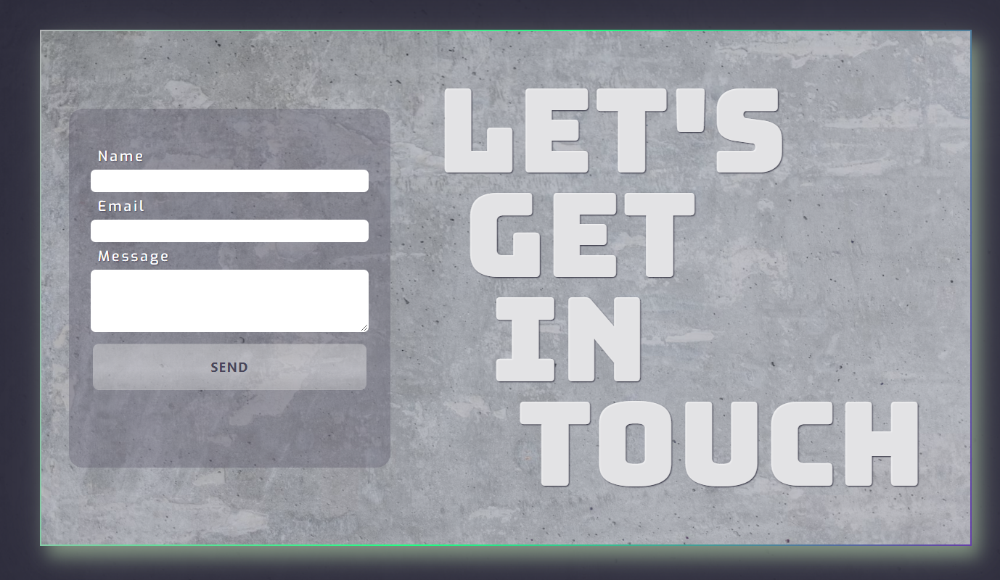
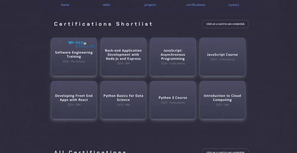

<h2>Portfolio Website</h2>

This repository contains a single-page application built with React and Vite, leveraging React Router for navigation.

All data is abstracted into a separate file, which helps maintain the application's codebase and facilitates future updates.

FetchData.js contains logic for fetching user data of this account('kweeuhree'), extracting top three languages of all repositories and calculating percentage of the language used compared to others.

<figure align='center'>
    
    <figcaption align='center'>Stats component</figcaption>
</figure>

The <code>useState</code> Hook is utilized throughout the application to enhance functionality. For instance, in the Projects component, it enables the carousel feature, while in the Certifications section, it enables overlay functionality. Additionally, in the Contacts component, <code>useState</code> keeps track of whether an email has been copied to the clipboard, dynamically changing the 'click to copy' button to 'copied' and back.

In the Contacts component, external links are generated from a centralized array. The titles 'Actively updated account' and 'Original account' are rendered 
conditionally based on the URL being accessed.

Created a custom useIntersectionObserver hook that will help apply dynamic styling. Initial logic was written for Climate View project, that I reworked into the custom hook.

Added EmailJS functionality. Originally I wanted to build a backend server to be able to receive an email, but later I have learnt that sending an email straight from the JavaScript code allows for the feature to work without page reload, so I opted for EmailJS instead of a scratch backend.

    

The following components are designed with reusability in mind:

<ul>
<li>Button: Used in the Project and Card components</li>
<li>Card: Utilized in the Certification and Skills components</li>
<li>NavBar: Also implemented in the Footer component</li>
<li>useIntersectionObserver: Used thoroughout the app to enable dynamic styling</li>
</ul>

<h3>Latest updates:</h3>

CertificationsPage returns two Certifications components with different objects passed as props in order to display different data. Each Certifications component returns Card components. Overlay logic lives inside Certifications.

<code>

  return ( 
&nbsp;<section className='certificatons-page' &nbsp;> 
&nbsp;&nbsp;<Certifications data={certificationsData} header="Certifications Shortlist" / > 
&nbsp;&nbsp;<Certifications data={allCertifications} header="All Certifications" / >
&nbsp;</section > 
  )}

</code>

<code>

        {/* loop through all credentials and return a card per credential */}
        {Object.values(data).map((item, index) => (
          <Card 
            thisClass={'cert'} 
            data={item} 
            key={index}
            // if clicked show relevant credential 
            action={()=>showOverlay(item)}
          />
        ))}

</code>

In Card component, Per Scholas logo conditionally renders if passed data contains 'Software Engineering Training'.

<code>

      {
      data.name.includes('Software Engineering Training') && 
      

        

      }

</code>

    

